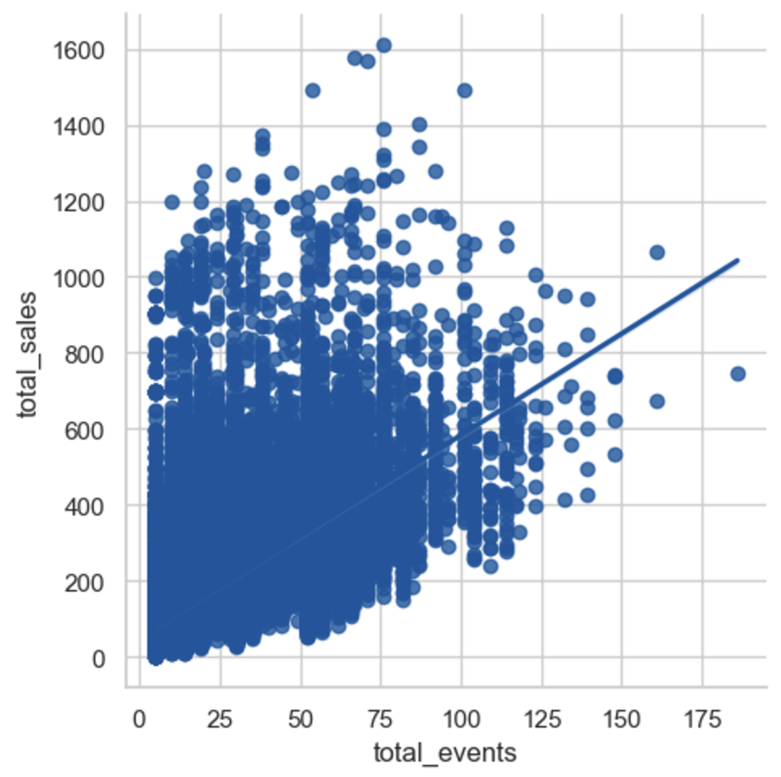
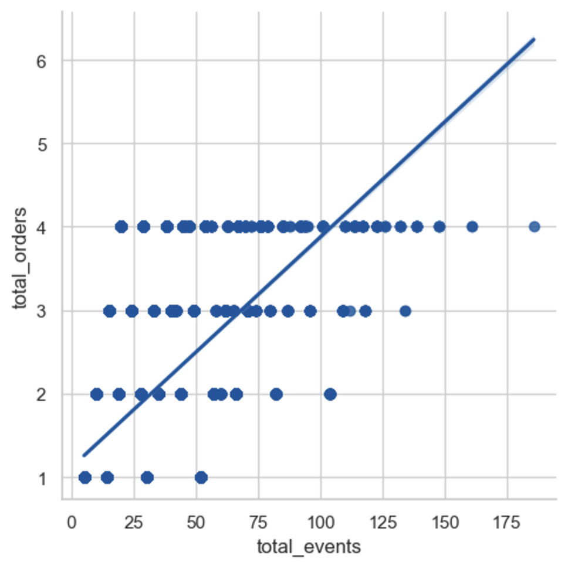
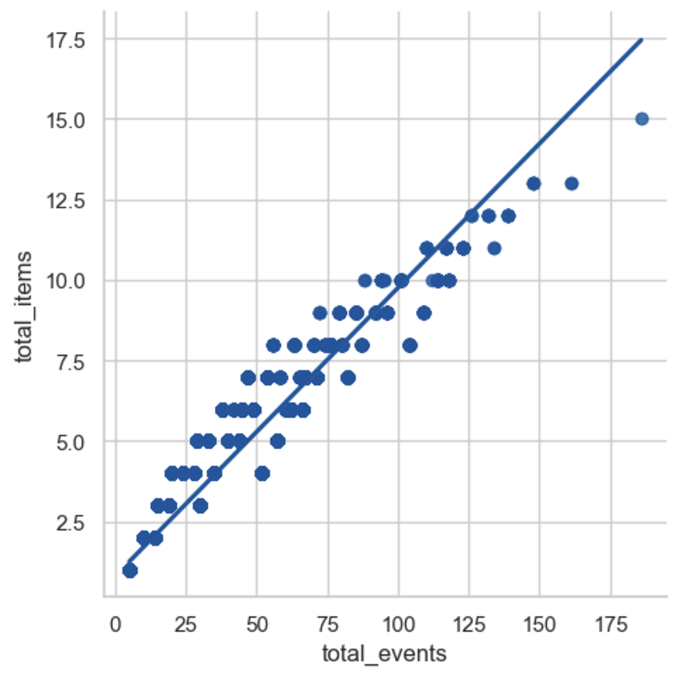

# E-Commerce Digital Marketing Analysis in Python
Digital marketing analysis in clothing e-commerce using fictitious [e-commerce data](https://console.cloud.google.com/marketplace/product/bigquery-public-data/thelook-ecommerce?inv=1&invt=AbitNA&project=corded-observer-442016-n7) officially provided by [Google Looker team](https://cloud.google.com/looker?hl=en_US&_gl=1*1wltkwm*_ga*MTA0OTQ0MzgxLjE3MzAxNDI4MzI.*_ga_WH2QY8WWF5*MTczMjgxMDc4MS4zNi4xLjE3MzI4MTA4MjEuMjAuMC4w) in Bigquery. This project focus on analyzing marketing performance using correlations between the number of marketing events and sales in Python Jupyter Notebook environment.

# Project Background
Aiming to evaluating the current marketing performance and getting insights from the analysis, this project calculates correlations between events as metrics of marketing efforts and sales as KPI and compares them in each country, gender, and traffic source. To prepare dataset enabling the analysis, four different tables including events, orders, products, and users information are connected and tailored in one table using SQL query. The SQL query can be found [here](https://github.com/NaokiKojimaJapan/e-commerce_marketing_analysis/blob/main/connected_table.sql).

# North Star Metrics and Dimensions
Sales: Metrics as KPI  
Events: Digital Marketing Advertising  
Correlation: Metrics as an evaluator of marketing performance (The higher number the correlation has, the higher result the maketing perform)  
The number of users: Metrics as potential market size  
Country: China/United States/Brasil/South Korea/United Kingdom/France/Germany/Spain/Japan/Australia/Belgium/Poland  
Gender: M as Male, F and Female  
Traffic Source: Search/Organic/Facebook/Email/Display  

# Data Structure
Four table including events, orders, products, and users table are connected.  
  

# Executive Summary
The marketing efforts overall work efficiently showing the correlation between the number of events and sales is over 0.6. That significant correlation is also found in the one between events and orders/items purchased, meaning the higher the number of events is getting, the more users purchase, or the events can correctly target the high-value users. The correlation is slightly different in each country, gender, and traffic source. However, except gender, the correlation is lower where more users are and higher where less users are. So, the marketing perfomance can be imnproved by analyzing the factors behind by comparing high correlation segments and low correlation segments.  
  

# Summary of Insights
## 1. Country: Correlation High in Europe, Low in Asia-Pacific
The correlation between events and sales is higher in European countries and lower in Asia-Pacific countries including Brazil. However, in terms of potential market size calculated by the number of users, Asia-Pacifc has much more users than Europe.

## 2. Traffic Source: Correlation High in Facebook and Email, Low in Organic, Search, and Display
The correlation between events and sales is higher in Facebook and Email, in oposit lower in Organic, Search, and Display. However, the most dominant traffic source for most of users is search which is the second lowest in the correlation.

# Recommendations & Next Steps
## 1. Country: 
## 2. Traffic Source: 
