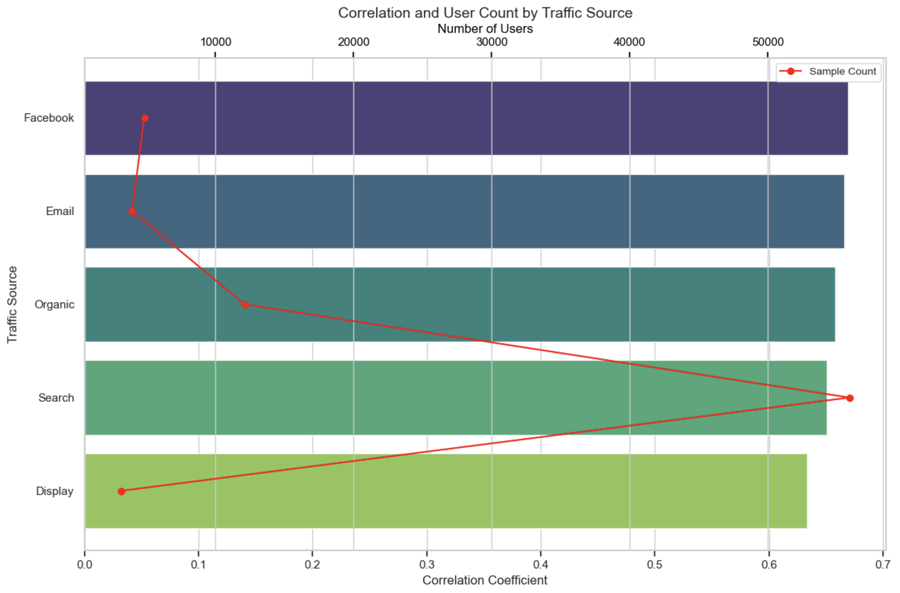

# E-Commerce Marketing Analysis in Python
Marketing analysis in clothing e-commerce using [fictitious data](https://console.cloud.google.com/marketplace/product/bigquery-public-data/thelook-ecommerce?inv=1&invt=AbitNA&project=corded-observer-442016-n7) officially provided by [Google Looker team](https://cloud.google.com/looker?hl=en_US&_gl=1*1wltkwm*_ga*MTA0OTQ0MzgxLjE3MzAxNDI4MzI.*_ga_WH2QY8WWF5*MTczMjgxMDc4MS4zNi4xLjE3MzI4MTA4MjEuMjAuMC4w) in Google Cloud BigQuery. This project focus on analyzing marketing performance using correlations between the number of marketing events and amount of sales in Python Jupyter Notebook environment. 
  
Linraries and codes used in the analysis can be found [here](https://github.com/NaokiKojimaJapan/e-commerce_marketing_analysis/blob/main/e-commerce_marketing_analysis.ipynb).

# Project Background
Aiming to evaluating the current marketing performance and getting insights to improve the performance, this project calculates correlations between events as metrics of marketing efforts and amount of sales as KPI and compares them in each country, gender, and traffic source. To prepare dataset for the analysis, four different tables including events, orders, products, and users information are connected and tailored in one table using SQL query in BigQuery environment. 
  
The SQL query used in analysis can be found [here](https://github.com/NaokiKojimaJapan/e-commerce_marketing_analysis/blob/main/connected_table.sql).

# North Star Metrics and Dimensions
Sales: Metrics as KPI  
Events: Digital Advertising as a metrics for marketing efforts
Correlation: Metrics as an evaluator of marketing performance (The higher the correlation number is, the higher the maketing performance is.)  
The number of users: Metrics as potential market size  
Country: China/United States/Brasil/South Korea/United Kingdom/France/Germany/Spain/Japan/Australia/Belgium/Poland  
Gender: M as Male, F and Female  
Traffic Source: Search/Organic/Facebook/Email/Display  

# Data Structure
Four tables, events, orders, products, and users table are connected.  
  

# Executive Summary
The marketing efforts overall work efficiently as shown that the correlation between the number of events and sales is over 0.6. That significant correlation is also found between events and orders/items purchased, meaning the higher the number of events is getting, the more users purchase items in from the company, or the events can correctly target the high-value users. The correlation is slightly different in each country, gender, and traffic source. However, except gender, **the correlation is lower where more users exist and higher where less users exist**. So, the marketing perfomance can be imnproved by analyzing factors behind this correlation gap by comparing high correlation segments and low correlation segments.  
  
Overall analysis in Jupyter Notebook can be found [here](https://github.com/NaokiKojimaJapan/e-commerce_marketing_analysis/blob/main/e-commerce_marketing_analysis.ipynb).
  
  

# Summary of Insights
## 1. Country: Correlation High in Europe, Low in Asia-Pacific
The correlation between events and sales is higher in European countries and lower in Asia-Pacific countries including Brazil when it comes to the correlation difference in countries. However, in terms of potential market size measured by the number of users, Asia-Pacifc has much more users than Europe.  
  

## 2. Traffic Source: Correlation High in Facebook and Email, Low in Organic, Search, and Display
As for traffic source that users use, the correlation between events and sales is higher in Facebook and Email, in oposite lower in Organic, Search, and Display. However, the most dominant traffic source for most of users is Search which is the second lowest in the correlation.  

# Recommendations & Next Steps
## 1. Country: Further Analysis on the Marketing Method in each Region
As shown in "Summary of Insights" section, the correlation is lower where more users exist and higher where less users exist when it is compared by both country and traffic source. To figure out factors behind the difference in the correlation, further analysis on the marketing method in both Europe and Asia-Pacific is recommended. 

## 2. Traffic Source: Allocate More Budget to Facebook and Email
As traffic source, Facebook and Email perform slighly better than the other three. So, it is good option for the marketing team to consider allocation marketing budget to Facebook and Email if it does not require additional costs and workloads. Also further analysis for more detail user actions, for example View Rate, Click rate, and Conversion Rate is also recommended to understand marketing performance difference in each traffic source.
